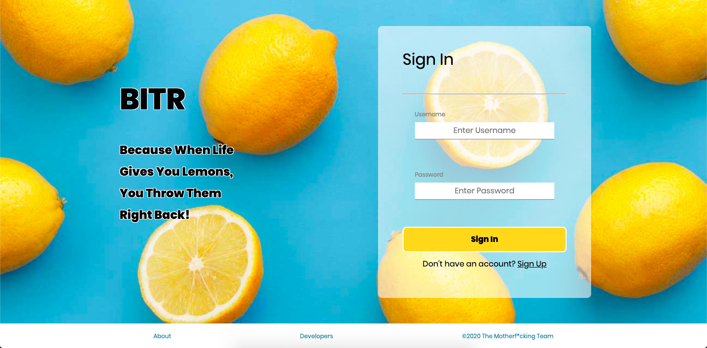
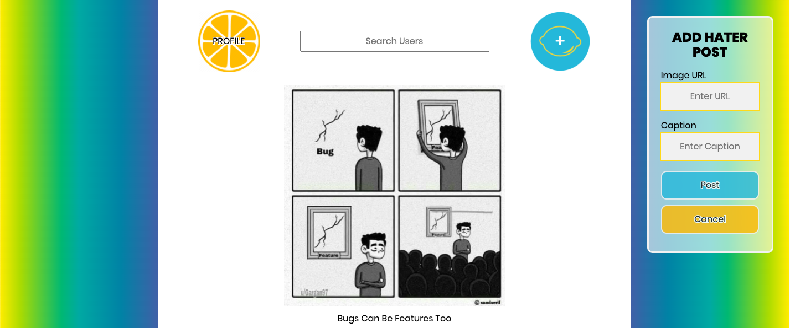
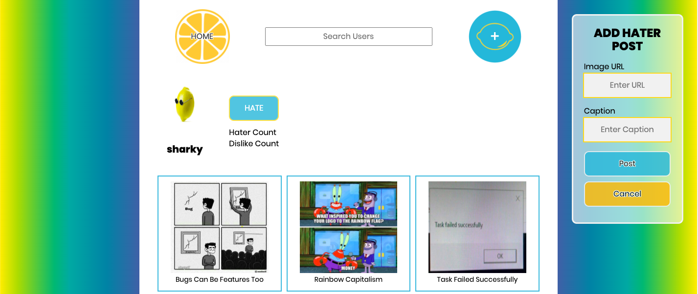

# Bitr

The black sheep of the Instagram extended family, Bitr is the social media platform for sharing all your gripes and aggravations in a cathartic release of visually inspiring imagery. Share the hate or those nettling pet peeves with your friends and followers (aka Haters) and discover the collective support of a community's empathetic ear as we all face the daily grind of life.

### Bitr Landing Page

### Bitr Home Page Feed

### Bitr Profile Page

## How To
Once users have created an account with Bitr and are logged into the application, they are directed to Bitr's Home Page, which displays a feed of curated images uploaded and shared by users on Bitr. Users can view images and their captions and in a future implementation, record their 'dislikes' as badges of their approval and comment on their fellow hater's shared gripes. Users can access their own profile page through the Home Page and view an image grid of all the images they've uploaded and shared on Bitr. In future iterations of the app, users will be able to hate ('follow') other users on their profile pages, which will then update the home page feed to display images shared by those users. Users can upload images using a pop-up accessed via the nav bar, this will render as a modal in a future update. 

## Technical Base
Built on NodeJS, Express and PostgreSQL with a front end application implemented using vanilla Javascript, CSS and HTML. Future development and technical specifications include a front end migration to ReactJS with design and styling using the Styled-Components library as well as an implementation of user authentication with Google Firebase.

<!--- Technical Documentation --->
<!--- Setup & Installation --->

